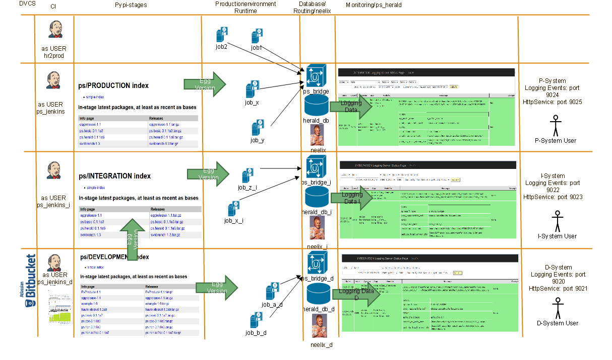
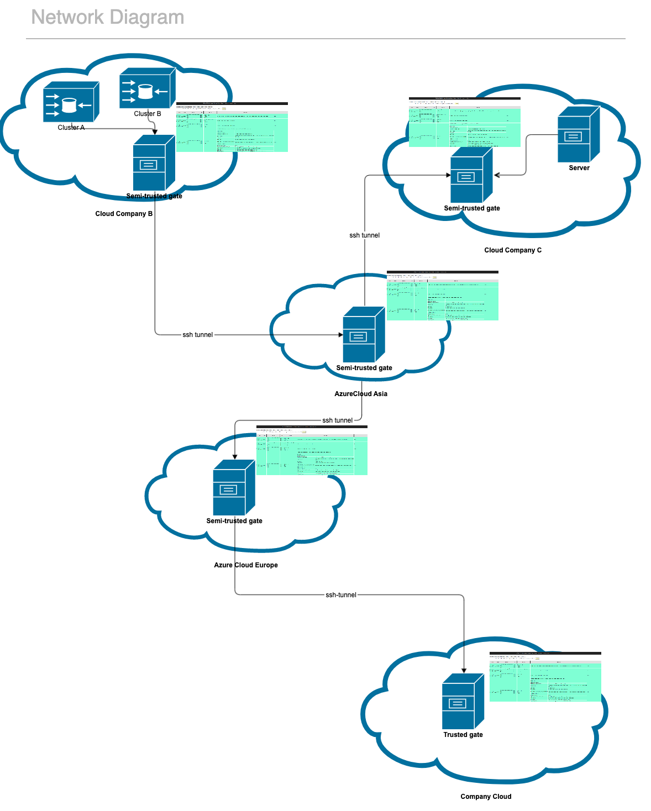
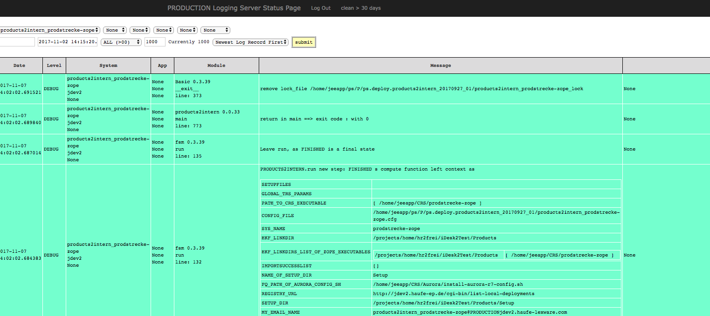

herald package
==============
The Herald  package provides three tools usable to monitor the behaviour of distributed applications

Herald's functionality is based on the **Basic** class, defined in the ps.basic package. For ease of use, we provide the
current documentation of that package at the end of this section. Within that documentation you'll  be enabled to use the 
ps.Basic.Basic   mechanism (especially the logging mechanism) within your application.

The **Basic** class (among other things) enhances/uses the standard python logging package - especially  the ability to log messages
to a stream-socket.

This package/the herald package adds mechanisms to:

                - put these messages into a central database (bridge)
                - route/bridge  these messages to additional destinations (bridge)
                - display in a web-server (herald)
                - take actions on special messages (neelix)
                - take actions on lost system heartbeat (neelix)

The tasks of the tools implemented within that package will be explained with the following picture .

If a program is running - let that program be named job or service (within the picture those programs are 
named job_[a,b,x,1,2] in column 4 (Productionenvironment Runtime) ) it emits logging-messages (via the ps.Basic.Basic class).

Those logging messages are :

     received by the ps_bridge daemon and inserted into a local sqlite database e.g. herald_db_d.
    
Those messages/events can be displayed/searched via herald. 

Those messages/events can be analyzed and further events could be triggered by neelix. 
 

.. note::
    
        The ps_bridge module allows for "duplication" of event streams - meaning it is possible to insert 
        logging messages into the local database AND to additionaly send that message to another bridge 
        (possibly residing on another machine/port). It is possible to route those message through 
        different ssh tunnels - so that on the different levels of trust - the messages of the behind 
        system could be analyzed. This is shown in the following picture.

Submodules
----------

        
ps_herald module
----------------
ps_herald is  a flask-based (http://flask.pocoo.org/)  web microframework, enabling us to display 
logging messages of the participating systems/services. The flask implementation part is based
on the documentation given on https://blog.miguelgrinberg.com/index.

It uses sqlachemy to access the sqlite database.

ps_herald listens for html-requests (normally issued by an user-interface  e.g. firefox/safari/chrome ...)
and returns corresponding log-messages.

The following picture shows a screenshot for the usage of  herald within google-chrome ...

Herald displays the messages of the "correlated" services in a table-format. 

From left to right you see:

   - date and time of insertion of the logging message into the database
   - logging level
   - service-name , machine-name and user_defined system-name
   - Application-specific logging fields
   - package name and version, function name, line number
   - logging message
   - stack-trace

Heralds Autodocumentation .....

.. automodule:: ps_herald
    :members:
    :undoc-members:
    :show-inheritance:

ps_bridge module
----------------

.. automodule:: ps_bridge
    :members:
    :undoc-members:
    :show-inheritance:

ps_neelix module
----------------

.. automodule:: ps_neelix
    :members:
    :undoc-members:
    :show-inheritance:

ps.Basic module
---------------

.. automodule:: ps.Basic
    :members:
    :undoc-members:
    :show-inheritance:

Module contents
---------------

.. automodule:: ps 
    :members:
    :undoc-members:
    :show-inheritance:

Installation
============

Install the package within a private virtualenv
-----------------------------------------------

To install the herald-package and it's services, we first create a new directory e.g. 
$HOME/nodename/ps.herald_$BUILD_DATE, copy the following template to that directory and
than execute the skript.

.. code-block:: bash

    #The Content of $HOME/.pip/pip.conf is
    #
    #[global]
    #index_url = https://vl-pypi.haufe-ep.de/ps/${DEV_STAGE}/+simple/
    #
    # and so points to the staging devpi server

    /bin/rm -fR ovenv
    mv venv ovenv

    virtualenv venv
    source venv/bin/activate

    pip install ps.basic
    pip install ps.herald

Maybe  we establish a link in $HOME/nodename so that, in lateron called scripts, we could use that link.

.. code-block:: bash
  
    ln -s ps.herald ps.herald_$BUILD_DATE

Integrating restart and invocation of neelix/herald with a local crontab
------------------------------------------------------------------------

Beneath an example how herald,ssh-tunnel, bridge and neelix currently 
are (re)started on sulu

.. code-block:: bash

  SHELL=/bin/bash
  MAILTO="thomas.setz@haufe-lexware.com"

  # The ssh tunnel for the bridge bringing the data on port 9017 of the eu_cloud machine to the loacal bridge 
  01,17,24,36,45,51,10 * * * 0-6     ssh -f -oExitOnForwardFailure=yes -R 9017:localhost:9024 eu_cloud -N > /home/hcn/ssh_tunnel.log  2>&1
  4 */2 * * 0-7                      export DEV_STAGE=PRODUCTION; cd /home/hcn/HCN_DataTransfer/u14_20170801; source venv/bin/activate && ps_neelix                      > neelix.log 2>&1
  04,16,36,44,51,01  * * * 0-7       export DEV_STAGE=PRODUCTION; cd /home/hcn/HCN_DataTransfer/u14_20170801; source venv/bin/activate && ps_herald                      > herald.log 2>&1
  05,15,21,34,46,50,02  * * * 0-7    export DEV_STAGE=PRODUCTION; cd /home/hcn/HCN_DataTransfer/u14_20170801; source venv/bin/activate && ps_bridge -s 1309600 -r 1024   > bridge.log 2>&1

